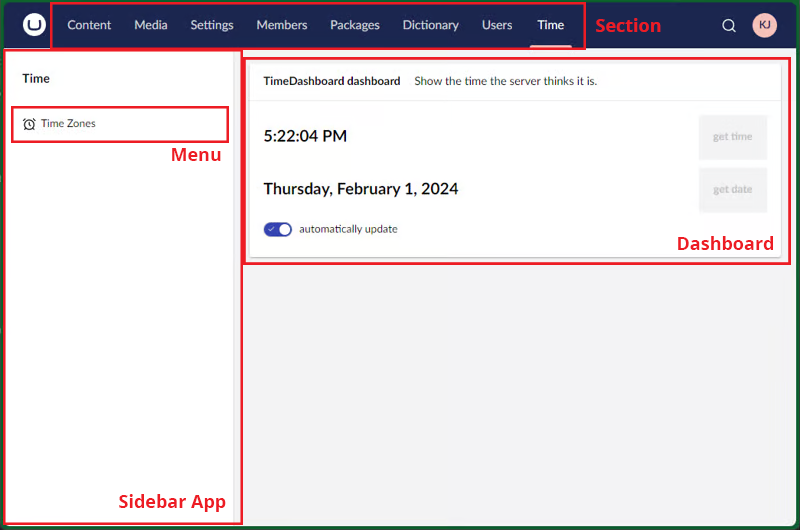
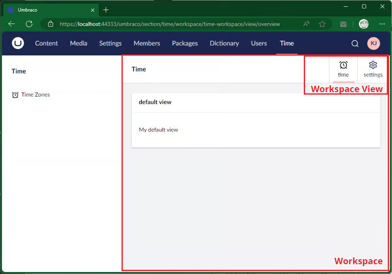
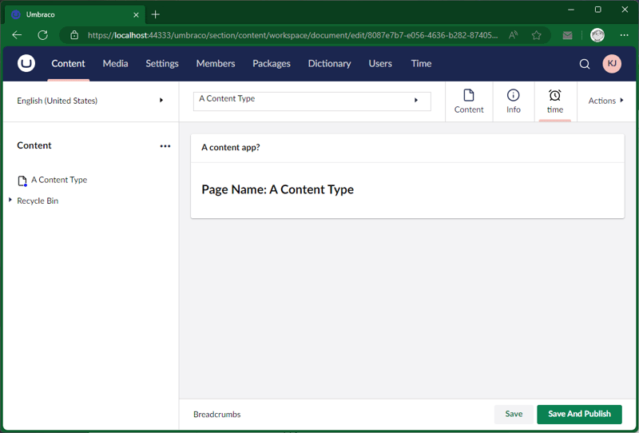
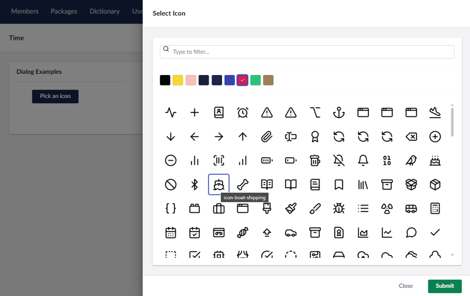

<!-- 

 -->

# **Bellissima**

A fully new modern front end to Backoffice, replacing Angular JS


<!-- 

- Talking about Belissima - Due in May
- Its a whole new backoffice that removes Angular JS and replaces with Web Components
- There are a lot of new concepts, so only going to give a very high level overview
- There is 20 slides + a demo, so will rush over a few things. Feel free to ask me more at the end.
- Very flexable, but not always as simple as a good ol' package manifest and a javascript file.
-->
---
# Thanks!

<br/><br>
<center>

## **A big shout-out to Kevin Jump**

https://dev.to/kevinjump/series

</center>


<!-- 

- A big thanks goes to kevin and his early adoptors series.
- Most of my presentation and examples are based on this series.

-->
---
## New Framework

- Everything in the new backoffice mainly comprises of:
  - Manifests
  - Web Components 
  - Contexts
- Prefered tools
  - Vite
  - Lit
  - Typescript

---

## Diving straight in

<br/>
<br/>
<br/>
<center>

## **Building a property Editor**

</center>

<!--

- going to demo how to build a property editor
- Some new tools and setup, but in some ways its familiar
- I wont go fully into tooling 
- Demo the new Backoffice

-->

---

## Creating a Custom Property Editor

1. Create a Package Manifest, Similar to before, but with a `propertyEditorSchema` to define the configuration settings and a  `propertyEditorUi` which defines ho the users sees when editing content (Controller and View)
2. Create a `DataEditor` C# Class
3. Optionally create a C# Configuration Editor (to define how the data is serialised in / out of the DB)
4. Optionally create a C# Value Editor for things like server side validation


<!-- 

1. Go though the steps

2. Demo the simple property editor

-->
---


## New Concepts

 - Package Entry Points
 - Contexts & Resources
 - Sections, sidebars and menus
 - Workspaces
 - Workspace views (Content Apps)
 - Header apps and modal dialogs
 - Actions
 - dialogs


<!-- 

- Many new concepts and terms
- Alot is same / same but different

 -->
---
 
 ## Entry Points

<div style="columns: 2;">

<div> 

``` json
{
"$schema": "../umbraco-package-schema.json",
"name": "mypackage",
"id": "mypackage",
"version": "0.1.0",
"allowTelemetry": true,
"extensions": [
  {
    "name": "mypackage.entrypoint",
    "alias": "mypackage.EntryPoint",
    "type": "entryPoint",
    "js": "/app_plugins/mypackage/assets.js"
    }
]}
```
</div>
<div>

<!-- 

 - Basically a way to create sub manifests in the package.manifest file
 - We can end up with a lot of includes and a large amount of manifests 
 - Goe though the manifest items of the screenshot

-->

``` javascript

const TimeManifest: 
   Array<ManifestGlobalContext> = [
	{
		type: 'globalContext',
		alias: 'time.context',
		name: 'Time context',
		js: () => import('./time.context.ts')
	}
  ]

export const manifests = [
	...TimeManifest
];
```

</div>
</div>

---

## Contexts & Resources

- **Context** is like a service, it's the method you want to get things in your dashboard, etc. it also stores some values, which you can 'observe' for changes than might happen elsewhere.

- **Repositories** handle the first part of getting things, they abstract away how the data is stored in your app

- **Resources** are the things that actually go fetch the data, in the case of the back office, these are the bits doing the http requests.

---
## Sections, Sidebars and Menus

<center>



</center>


<!-- 
 - Go though each section shown in the screenshot

-->
 ---

### 1. Sections


``` javascript
const sectionManifest : ManifestSection = {
    type: 'section',
    alias: 'time.section',
    name: 'time section',
    weight: 10,
    meta: {
        label: 'Time',
        pathname: 'time'
    }
}
```
<!--

 - Use the alias to then update your dashboard manifest to show on the new section

-->
---

### 2. Sidebar App

``` javascript
const sidebarAppManifest : ManifestSectionSidebarApp = {
    type: 'sectionSidebarApp',
    kind: 'menuWithEntityActions',
    alias: 'time.sidebar.app',
    name: 'Sidebar app',
    meta: {
        label: "Time",
        menu: "time.menu"
    },
    conditions: [
        {
            alias: "Umb.Condition.SectionAlias",
            match: "time.section"
        }
    ]   
};
```
<!--

 - The menu can be more compicated and possible to fetch the menu tree dynamically 

-->
 ---
 
### 3. Menu and item(s)

``` javascript
const menuManifest : ManifestMenu = {
    type: 'menu',
    alias: 'time.menu',
    name: 'time sidebar menu',
    meta: {  label: 'Time'  }
}
const menuItemManifest  : ManifestMenuItem = {
    type: 'menuItem',
    alias: 'time.menu,item',
    name: 'time menu item',
    meta: {
        label: 'Time Zones',
        icon: 'icon-alarm-clock',
        entityType: '',
        menus: [ 'time.menu'  ]    }
}
```
<!--

 - Previously called the tree
 - Add the condition on what section it shows up for

-->
 ---


## Workspaces

<div style="columns: 2;">

<div> 



</div>
<div>

``` javascript
var workspaceManifest : ManifestWorkspace = {
    type: 'workspace',
    alias: 'time.workspace',
    name: 'time workspace',
    element: ()=> 
        import('./workspace.element'),
    meta: {
        entityType: 'time-workspace'
    }
};
```

</div>
</div>

<!-- 

 - I wont go into detail: Basically a workspace is like the wrapper for an App in that section 
 - The Edit Content View, Media items, etc are workspaces. These are all extendable.  
 - Steps include:
   - Creating a Workspace Manifest
   - Link the Menu Item using its entity type
   - Create a Workspace Context which ties the workspace into Umbraco
   - Create Workspace Views that link to the workspace 


-->

 ---
## Workspace views

<center>

**The artist formally known as *"Content apps"***



</center>


<!-- 
 - Describe what part of the screenshot is the content App
 - Can be added to your own custom workspaces
  - Can be added content, media, doctypes, datatypes, users, event the log viewer

-->
 ---
## Workspace views


``` Javascript
@customElement('time-document-workspace-view')
export class TimeDocumentWorkspaceElement 
  extends UmbElementMixin(LitElement) {
    var pageName = "";
    constructor() {
      super();
      this.consumeContext(UMB_WORKSPACE_CONTEXT,
        (nodeContext) => {
          var variantContext = (nodeContext as UmbVariantableWorkspaceContextInterface);
            pageName = variantContext.getName();        
        });
    }
    render() {
        ...
    }
}
```

<!-- 

 - Firstly, Create a Manifest that targets the workspace section.
  - The manifest points to our javascript / custom element "time-document-workspace-view"
 - In this example we grab the workspace context of the content node and store in a variable

-->

 ---
## Workspace views

``` Javascript
@customElement('time-document-workspace-view')
export class TimeDocumentWorkspaceElement 
  extends UmbElementMixin(LitElement) {
    var pageName = "";
    constructor() {
      ...
    }
    render() {
        return html`
            <uui-box headline="A content app?">{{pageName}}</uui-box>
        `;
    }
    static styles = css`
        uui-box {  margin: 20px; }
    `
}
```
<!-- 

 - Create the render method that returns the HMTL and UUI Web components
 - You can create custom styles for your Web component too

-->
 ---
## Header apps and modal dialogs


<!--

 - Create a Header manifest and import our Web Component JS
 - Web component renders the alarm clock button and triggers the click
 - This trigger consumes the modal context and triggers our modal in the next step
 - Create a modal manifest that uses the UUI Dialog and handles the actions
 


-->

 ---
## Actions

<div style="columns: 2;">

<div> 


#### Entity Actions


</div>
<div>

#### Workspace Actions


</div>
</div>

<!-- 

- You can add an action to just about anything
- Combination of Manifest, and web components

-->
 ---
# Dialogs



<!-- 

- Used to use the "Editor Service" in Angular JS
- "Model Manager" is the replacement to open dialogs
- Consume the Model Manager Context
- Open the Modal
- Much the same way as before

Open Anything: 
- UMB_ICON_PICKER_MODAL
- UMB_DATA_TYPE_PICKER_MODAL,
- UMB_DOCUMENT_TYPE_PICKER_MODAL,
- UMB_TEMPLATE_PICKER_MODAL,
- UMB_DICTIONARY_ITEM_PICKER_MODAL,
- UMB_PARTIAL_VIEW_PICKER_MODAL,
- UMB_MEDIA_TREE_PICKER_MODAL
- UMB_BLOCK_CATALOGUE_MODAL,
- UMB_CODE_EDITOR_MODAL,
- UMB_CONFIRM_MODAL
-->

---

### Links

<div style="columns: 2">
<div>

Presentation :  https://bit.ly/bellissima-Sydney

Early Adopters Guide to v14: 
https://dev.to/kevinjump/series
Bellissima WIP articles: https://dev.to/leekelleher/umbraco-bellissima-wip-articles-29f8


</div>
<div>

This Presentation:


</div>
</div>