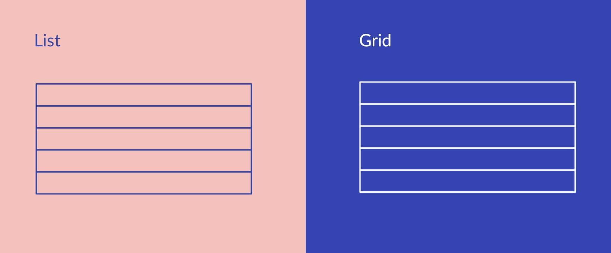
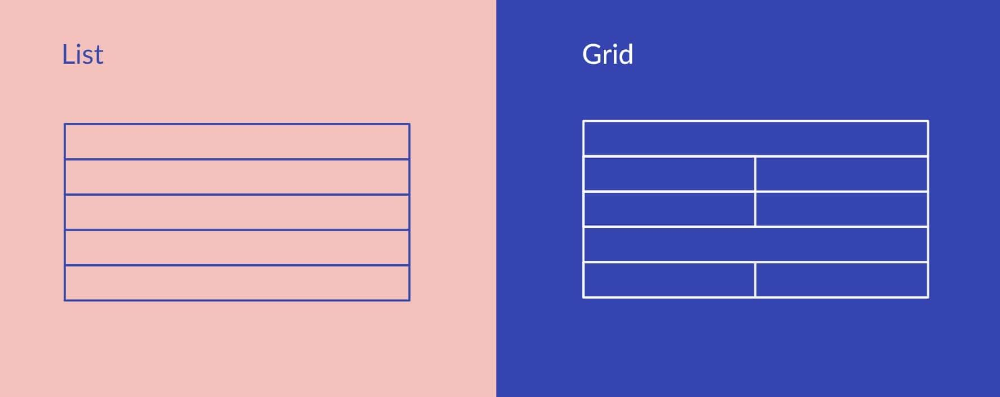
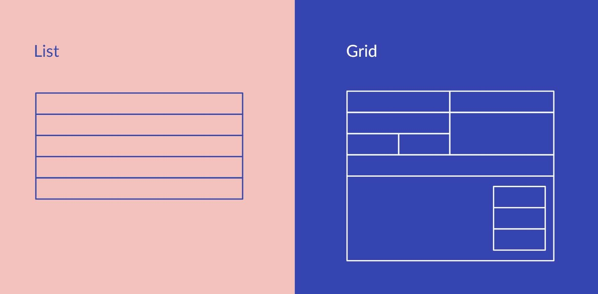
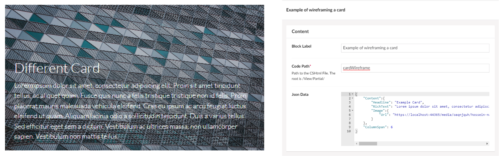

<!-- 

 -->

# **Umbraco Block Grid**

<quote>"Launched with Umbraco 11 the Block Grid Editor brings new ways of structuring content, a smoother editing interface, and improved configuration and developer experience"</quote>

---

##### BlockGrid Vs Block

### Structure and Layout Capabilities

---
##### BlockGrid Vs Block

### Block Size

---
##### BlockGrid Vs Block

### Block Areas

---

### Setting up a Block Editor

1. Recommend starting with [Umbraco.BlockGrid.Example.Website](http://Umbraco.BlockGrid.Example.Website) Nuget Package
2. Create the document types for each available block
3. Create a Block Grid Datatype
    1. Add Layouts Blocks
    2. Add Content Blocks
4. Add the datatype to you page document types
5. Create the page

<!--

run though demo of:
- Doc types
- block grid DataType
    - Layouts / Areas
    - Blocks / Areas

- Create basic page with simple blocks
- Demo resizing columns

-->

---

### Rendering Content blocks

Layout (Items) → Areas → Area → Content Blocks (Items) → Areas → Area

<!-- 

Show how views are setup and run though grid

-->

---

### Create Custom Backoffice Views

1. Create App Plugin
2. Create the html view with:
    1. Edit command 
    2. Data bindings
    3. Areas

---

### Custom wireframing component

---

### Advanced Concepts

1. Use Compositions for common settings (Like BgImage, Padding)
2. Use Tag Helpers for common block settings
3. Consistent Naming Convention
    1. Layouts “[Layout] 1 column”
    2. Blocks “[Block] Heading”
    3. Settings “[Setting] Background Colour”

---
# **Thanks**

References:
https://umbraco.com/blog/deep-dive-block-grid-editor-part-1/

Presentation :  https://bit.ly/umbraco-uui

Sample Code: 
https://bit.ly/uui-sample 
Umbraco Storybook: https://uui.umbraco.com/
Umbraco UI on Github:
https://github.com/umbraco/Umbraco.UI

This Presentation:

