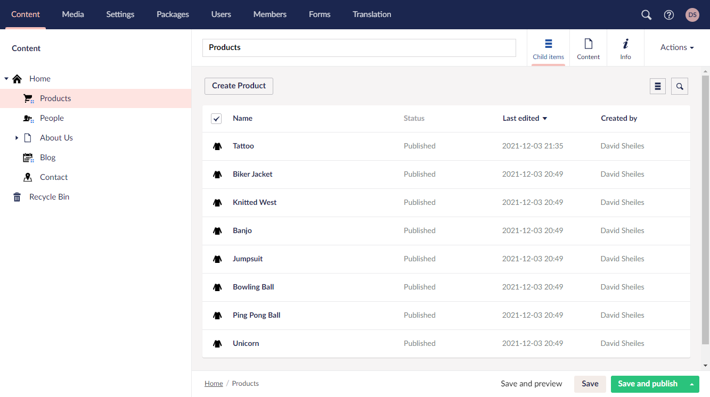
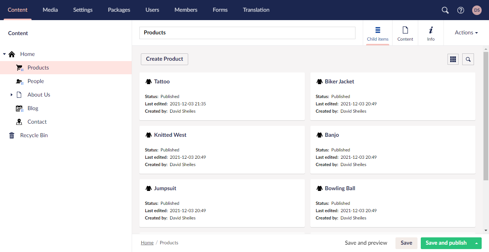
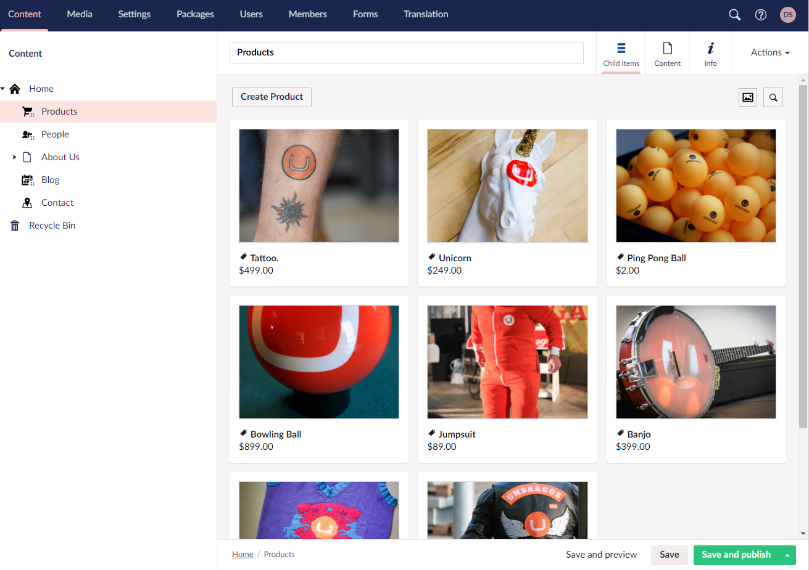

# **Custom List Views**

Creating a custom list view to make it easier for content editors to view product images and prices

---

## Out of the box

<div class="row">





</div>


------


## Our Custom View




<footer>

<a href="https://localhost:44330/umbraco#/content/content/edit/1098" target="_blank">Demo</a>

</footer>
<!--
1. Easy for editors
 -->


---


## Creating The Components

#### Package Manifest

`/App_Plugins/DM.ListViews/package.manifest`

```css
{
"css": ["~/App_Plugins/DM.ListViews/Products/Products.css"],
"javascript": ["~/App_Plugins/DM.ListViews/Products/Products.controller.js"]
}
```

<!-- 
We have 4 files:
1. package.manifest
2. Html View
3. Javascript Controller
4. CSS
-->

---
#### HTML View

`/App_Plugins/DM.ListViews/Products/Products.html`

```html
<div ng-controller="DM.Listview.ProductsController as vm">
    <div ng-repeat="item in items" ng-class="{'-selected': item.selected}">
        <div class="thumbnail" 
            style="background-image: url({{item.photos[0].src}}?width=300"
            ng-click="vm.toggleItem(item)"></div>
        <h5  ng-click="vm.goToItem(item)">
            <umb-icon icon="icon-tag"></umb-icon> 
            {{item.productName || item.name}
        </h5>
        <p>{{item.price | currency}}</p>
        </div>
    </div>
```
<!-- 
1. ng-controller: DM.Listview.ProductsController
2. ng-repeat
3. ng-class: Selected
4. BG Image: item.photos[0].src
5. ng-click: vm.toggleItem(item)
6. ng-click: vm.goToItem(item)
7. {{item.productName || item.name}
8. {{item.price | currency}}
-->
---
#### JS Controller View

`/App_Plugins/DM.ListViews/Products/Products.controller.js`

1. Create the Controller

```JS
function ListViewProductsController($scope, listViewHelper, mediaResource) {
    var vm = this;
}

angular.module("umbraco").controller("DM.Listview.ProductsController", 
ListViewProductsController);

```

---
#### JS Controller View

2. Media URLs

```JS
    //Loop though each media item and get the image URL
    angular.forEach($scope.items, function (value, key) {
        if (value.photos.length > 0) {
            updateMediaUrl(value.photos[0]);
        }
    });

    //Gets the media Url by the mediaKey and adds it to our object
    function updateMediaUrl(photoObj) {
        mediaResource.getById(photoObj.mediaKey)
            .then(function (media) {
                photoObj.src = media.mediaLink;
            });
    }
```

---
#### JS Controller View

3. Click the thumbnail to select / deselect the item

```JS

    //Select / Unselect Item
    vm.toggleItem = function (item) {
        if (item.selected) {
            listViewHelper.deselectItem(item, $scope.selection);
        } else {
            listViewHelper.selectItem(item, $scope.selection);
        }
    }

```

---
#### JS Controller View

4. Click the name to open / edit the item

```JS

    //Open Item to edit
    vm.goToItem = function(item, $event, $index) {
        listViewHelper.editItem(item, $scope);
    }

```
---

### Bringing it all together


<footer>

<a href="https://localhost:44330/umbraco#/settings/documentTypes/edit/1096" target="_blank">Demo</a>

</footer>

---
# **Thanks!**

- Component Examples [https://bit.ly/umb-components](https://bit.ly/umb-components)
- Umbraco TV - [https://bit.ly/tv-listview](https://bit.ly/tv-listview)
- Demo Project - [https://bit.ly/DemoProj](https://bit.ly/DemoProj)
- Download this presentation - [https://bit.ly/CustomListViews](https://bit.ly/CustomListViews)


<!-- 

1. Creating the list view
- Add the extra properties
- Add the view
-->