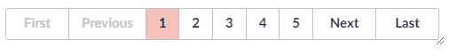
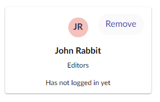
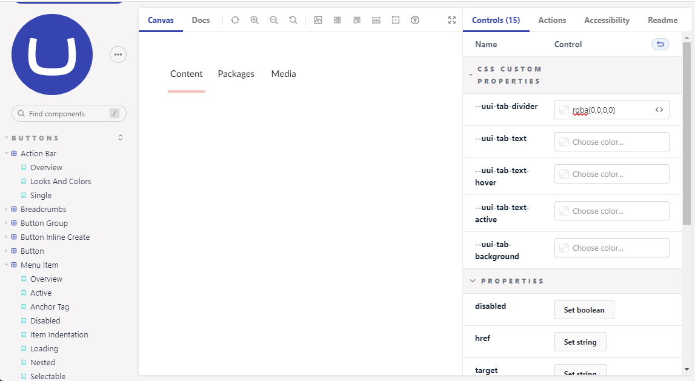
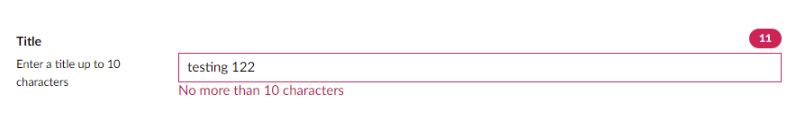

<!-- 

 -->

# **Umbraco UUI Library**

Umbraco webcomponents for creating backoffice components 

---

### Web Components


<div style="columns:2">

``` html
<uui-pagination total=5></uui-pagination>
```

<div style="padding-top:30px;">



</div>

</div>


<div style="columns:2">

``` html
<uui-card-user ng-prop-name="vm.user.name" 
  ng-on-open="open()">
  <uui-action-bar slot="actions">
    <uui-button label="Remove">
        Remove
    </uui-button>
  </uui-action-bar>

  <div style="margin-bottom: 12px">
    Editors
  </div>
  <div>Has not logged in yet</div>
</uui-card-user>
```

<div style="padding-top:20px;">



</div>

<div>

<!--
Web components contain:
- Properties / Attributes
- Events
- Slots
-->

---

### Why will it make you happy?

<ul style="columns:2">
    <li>Web components</li>
    <li>Each component is an ES module</li>
    <li>Javascript Framework Agnostic</li>
    <li>Documentation as a first-class citizen</li>
    <li>IntelliSense</li>
    <li>Built-in accessibility</li>
    <li>Semantic versioning</li>
    <li>Open Source</li>
</ul>


---

### Umbraco Storybook




---

### Getting our hands dirty!

<!--
<uui-form-layout-item class="text-counter">
  <uui-tag ng-prop-color="model.value.length < 10 ? 'primary':'danger'"
  class="counter">
    {{model.value.length}}
  </uui-tag>
  <uui-input ng-prop-value="model.value"
    ng-on-input="model.value = $event.currentTarget.value" ng-prop-error="model.value.length > 10" 
    error-message="No more than 10 characters"></uui-input>
</uui-form-layout-item>

-->




---

### Custom Property Overview

- Add script tag to uui`<script src="https://cdn.jsdelivr.net/npm/@umbraco-ui/uui@1.0.0-rc.0/dist/uui.min.js"></script>`
- ng-prop- to set properties
- ng-attr- for attributes (Dont forget to use {{}} )
- ng-on- for events

---

## Umbracoless UUI
### Typescript example:

1. Run `npm i @umbraco-ui/uui`
2. Add `import '@umbraco-ui/uui';`
3. Add `schemas: [CUSTOM_ELEMENTS_SCHEMA]` to app.modules.ts
4. properties, attributes and events:
    - `[property-name]` to set properties
    - `[attr.attribute-name]` for attributes
    - `(event-name)` for events

---

### Links

<div style="columns: 2">
<div>

This Presentation:  https://bit.ly/umbraco-uui

Umbraco Storybook: https://uui.umbraco.com/

Umbraco UI on Github:
https://github.com/umbraco/Umbraco.UI

</div>
<div>

This Presentation:


</div>
</div>